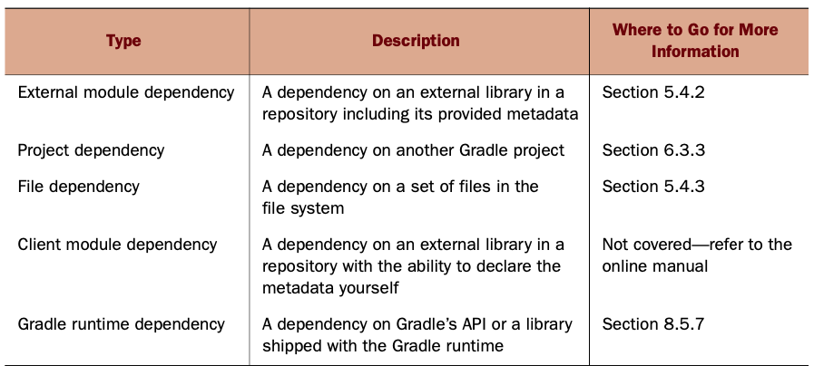

Goal
* remove manual intervention
* a push-button fail-safe software release process

Types of automation
* on-demand
* triggered
* scheduled

Build automation can be expressed as DAG.
* build script
  - project: top-level container; one per script
  - multiple targets: a target has multiple tasks
  - used tasks: a piece of executable codes
* build input, output
* build engine: build internal model, execute step by step
* dependency manager: retrieve external dependency (jar)

Build tool
* Ant: oldest
  - build script written in XML
  - integrates with Ivy dependency manager
  - pros: flexible, versatile
  - cons: lack standardization, lots of boilerplate, no built in dependency manager
    * XML not good with conditional statement
* Maven
  - plugin: custom logic
  - lifecycle:
    * validate
    * compile
    * test
    * package
    * integration test
    * verify
    * install
    * deploy
  - provide good convention: default layout
  - Maven Central: most popular binary artifact repository
  - dependency:
    - scope determines phase of lifecycle the dependency applies
  - pros: easy, standardized, dependency manager
  - cons: difficult for custom logic

___
### Gradle
* support groovy and java
* plugin: share reusable code across builds and projects
* Ant target maps to gradle tasks
* exclude a task with `-x` argument
  - dependent tasks are also excluded "smart exclusion"
```bash
-- examine avaiable tasks
gradle -q tasks --all

-- log info
gradle groupTherapy -x yayGradle0 -i

gradle groupTherapy -x yayGradle0 -i -s
```

Gradle Daemon
* run as background process
* gradle command will reuse the daemon process for subsequent build, avoiding the startup cost
* expire after 3 hour idle time
```bash
-- run as daemon
gradle --daemon
ps | grep gradle
gradle groupTherapy --daemon

-- stop daemon
gradle --stop
```

#### Web App
* `war` plubin
* `jetty` -> replaced by `gretty`

```java
// customize jetty config
jettyRun {
  httpPort = 9090
  contextPath = 'todo'
}
```

Gradle Wrapper
* enables a machine to run a Gradle build script without having to install the runtime.
* ensure build is run with correct gradle version
* The ultimate goal is to create reliable and reproducible builds independent of the operating system, system setup, or installed Gradle version

* step 1: add a wrapper tasks
  - can be any name, but the convention is `wrapper`
  - specify gradle version
* step 2: execute wrapper task **once**: `gradle wrapper`
* step 3+: use the wrapper’s script to execute your build
* check in wrapper script to version control

Generated file
* gradle-wrapper.jar: Gradle wrapper microlibrary contains logic to download and unpack distribution
* gradle-wrapper.properties: Wrapper metadata like storage location for downloaded distribution and originating URL
* gradlew, gradlew.bat: Wrapper scripts for executing Gradle commands

```BASH
gradlew.bat jettyRun
```

### Mastering Gradle Fundamentals
Components of a build script
* project: a script can have multiple interdependent projects
* task
* properties: required to use `ext` namespace
  - can also define a property file `gradle.properties`
  - pass in properties in CLI via `-P` or `-D` flags
  - access properties: `$version` or `ext.version`
* dependencies are distributed and used in the form of JAR files.

```java
// declare action dependencies
task first << { println "first" }
task second << { println "second" }

task printVersion(dependsOn: [second, first]) << {
  logger.quiet "Version: $version"
}

task third << { println "third" }
third.dependsOn('printVersion')
```

* finalizer tasks: for example, integration test against a deployment env

```java
task first << { println "first" }
task second << { println "second" }
first.finalizedBy second
```

### Build by Convention
* source code: `src/main/java`
* test code: `src/test/java`
* web app (html, css): `src/main/webapp`

### WAR
* Extend `java` plugin, only needs to import once
* packaged files is in `./build/libs`
* Check content of packaged jar: `jar tf 04_web_app.war`
Build phases
1. initialization
2. configuration
3. execution

### Scope
* compile: not provided at runtime
* providedCompile: need to compile, but provided at runtime
* runtime: no need to compile & provided at runtime

### Lifecycle
1. initialization phase: init a project instance
2. configuration phase
  - execute task config blocks before any tasks
  - executed with every build of the project
3. execution phase: see example `09_config_file`
  - execute tasks in correct order (dependency)
  - up-to-date tasks are skipped

### Listening to Lifecycle Events
* define code in a closure
* use listener interface

### Build Env
* create init script in `~/.gradle/init.d/build-announcements.gradle`
* won't get fired if placed in build.gradle because project init already happened (init phase)
```
gradle.projectsLoaded { Gradle gradle ->
  gradle.rootProject {
    apply plugin: 'build-announcements'
  }
}
```

### Resources
* Asgard, a web-based cloud management and deploy- ment tool built and used by Netflix
* search maven repository: http://search.maven.org/
* Jetty: allow changing static files without restarting container
* JRebel: perform hot deployment for class file changes.

___
## Chapter 5 - Dependency
Two open source solution
* Apache Ivy for ant project
* Maven



### Configuration
* Every project owns a container of class `ConfigurationContainer` that manages the corresponding configurations.
* a dependency is defined by `group`, `name`, `version`, `classifier`
* configuration is a logical grouping of dependencies
* java plugin provides 6 configurations
  - compile
  - runtime
  - testCompile
  - testRuntime
  - archive
  - default
* excluding transitive dependency:
* detects if an artifact was changed in the repository by comparing its local and remote checksum
* Gradle support offline mode, which only checks local cache

```java
dependencies {
  cargo('org.codehaus.cargo:cargo-ant:1.3.1') {
    exclude group: 'xml-apis', module: 'xml-apis'

    // or exclude all
    // transitive = false
  }
  cargo 'xml-apis:xml-apis:2.0.2'
}

// print path to local cache
task printDependencies << { configurations.getByName('cargo').each { dependency ->
      println dependency
   }
}

// no cache
configurations.cargo.resolutionStrategy {
  cacheDynamicVersionsFor 0, 'seconds'
}
configurations.compile.resolutionStrategy {
  cacheChangingModulesFor 0, 'seconds'
}
```

* generate dependency report for a dependency of a configuration

```bash
gradle -q dependencyInsight --configuration cargo --dependency

gradle --refresh-dependencies

```

___
## Chapter 6
* The declaration of subprojects in a multiproject build is done via the settings file. `settings.gradle`
* settings file is evaluated and executed during the initialization phase
* The root project and all subprojects should use the same group and version property value.
* All subprojects are Java projects and require the Java plugin to function correctly, so you’ll only need to apply the plugin to subprojects, not the root project.
* project dependency: `compile project(':model')`
```bash
gradle projects
gradle :model:build
gradle :repository:build -a
gradle :repository:buildNeeded
gradle :repository:buildDependents
```
